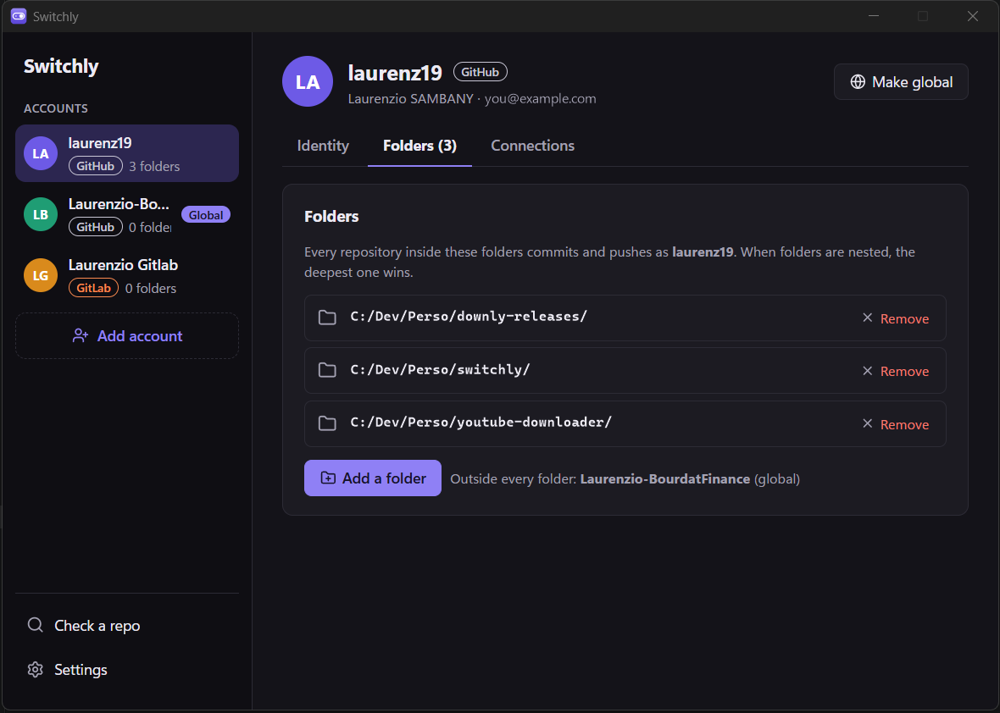
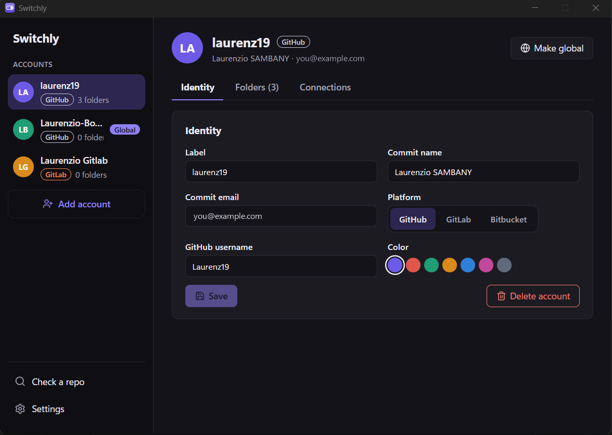
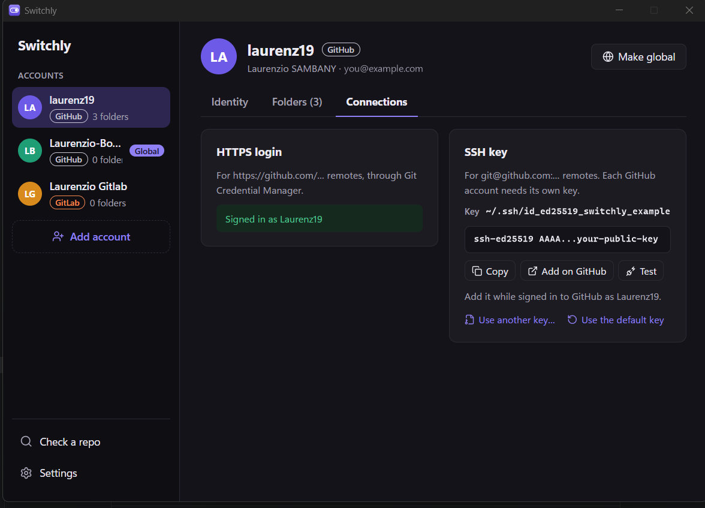
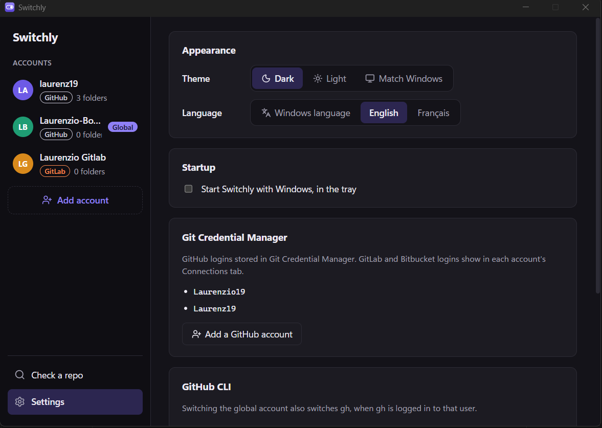
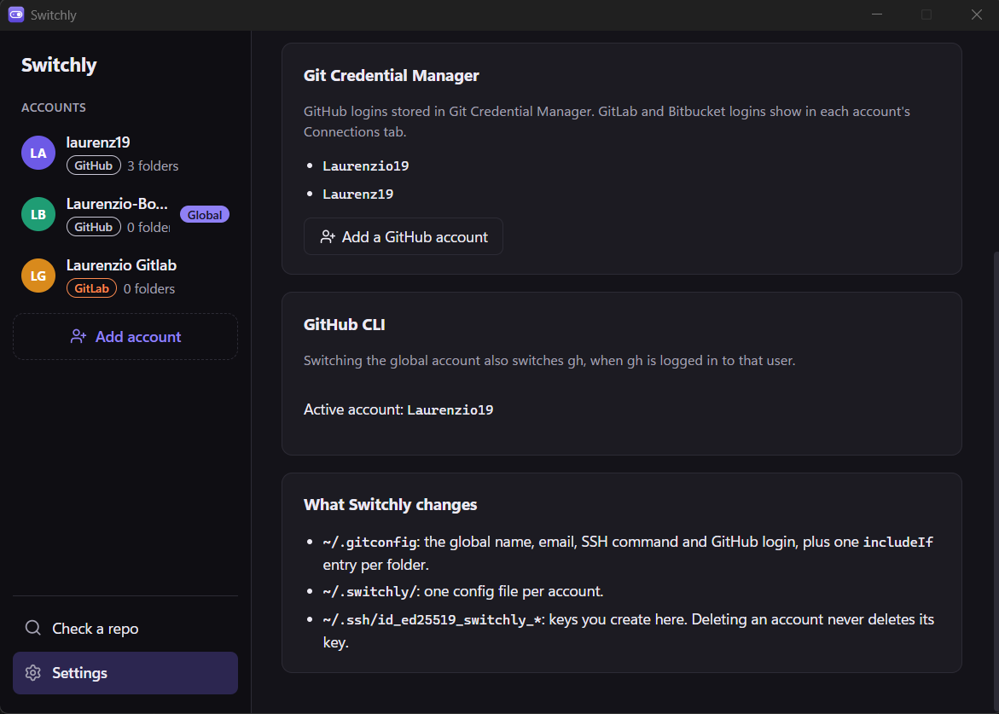

<p align="center">
  
</p>

<h1 align="center">Switchly</h1>

<p align="center">Use the right GitHub, GitLab or Bitbucket account in every folder, from the Windows tray.</p>

Work with several Git accounts, like a personal GitHub, a work GitLab and a client's Bitbucket? Tell Switchly which account each folder uses. Every repository inside it then commits with the right name and email and pushes with the right login, and you stop pushing to a client's repo as yourself.

<p align="center">
  
</p>

## Requirements

- **Windows 10 or 11**, x64 or ARM64.
- **[Git for Windows](https://git-scm.com/download/win) (required).** Switchly configures git and doesn't work without it. Git for Windows also installs **Git Credential Manager**, which Switchly uses for HTTPS logins. Keep its default options when installing. To check it's there, run in a terminal:
  ```
  git --version
  git credential-manager --version
  ```
- **OpenSSH**, only for SSH remotes. It's built into Windows 10 and 11.
- **GitHub CLI** (`gh`), optional: when it's installed, switching the global account also switches `gh`.

## Install

Download the latest installer from **[Releases](../../releases/latest)**:

| Your PC | File |
|---|---|
| Windows (most PCs) | `Switchly_<version>_x64-setup.exe` |
| Windows on ARM (Snapdragon, Surface Pro X…) | `Switchly_<version>_arm64-setup.exe` |
| Company deployment (GPO, Intune) | `Switchly_<version>_x64_en-US.msi` |

The installer isn't signed yet. If Windows SmartScreen warns, click **More info**, then **Run anyway**.

## Getting started

1. **Add your accounts.** For each one: a label ("Personal", "Client A"), the commit name and email, its platform (GitHub, GitLab or Bitbucket) and its username there.
2. **Give each account its folders.** In the account's **Folders** tab, add the folders that hold its repositories, like `C:\Dev\ClientA`. Every repository inside a folder uses that account. When folders are nested, the deepest one wins.
3. **Connect each account** in the **Connections** tab:
   - **HTTPS** (`https://...` remotes): sign in once per account through Git Credential Manager, which handles GitHub, GitLab and Bitbucket logins.
   - **SSH** (`git@...` remotes): create a key for the account, click **Add on GitHub/GitLab/Bitbucket** while signed in with that account, then **Test**.
4. **Pick a global account** with **Make global**. It's used in every repository that no folder covers.
5. **Optional safety nets:**
   - **Commit signing** (account → **Connections**): signs the account's commits with its SSH key, for a "Verified" badge on GitHub and GitLab. Add the same key on the site a second time, as a signing key.
   - **Commit guard** (**Settings**): git refuses a commit whose email isn't the one of the account that owns the repository's folder. Skip it once with `git commit --no-verify`.
6. **Check a repository** whenever you're unsure: Switchly shows which identity it will commit and push with, where each setting comes from, and what looks wrong.

## Screenshots

| Identity | Connections |
|---|---|
|  |  |

| Settings | |
|---|---|
|  |  |

## Everyday use

- Each account shows its platform with a colored badge: GitHub, GitLab or Bitbucket.
- The **tray icon** next to the clock shows the global account on hover.
- **Left click**: a small popup to switch the global account in one click.
- **Right click**: a menu to switch, open Switchly or quit.
- Closing the window keeps Switchly in the tray. **Settings** can start it with Windows.
- Switching the global account also switches the `gh` CLI when `gh` is logged in to that user (`gh auth login` once per account).
- Dark or light theme, in English or French, in **Settings**.
- **Updates install themselves**: when a new version is out, Switchly offers it at startup (or from **Settings → Updates**). Updates are signed, and Switchly refuses any that isn't.

## How it works

Switchly only writes standard git configuration, and leaves logins to Git Credential Manager: it never stores or sees a token. Your setup keeps working even when Switchly isn't running:

- `~/.gitconfig`: the global identity, plus one `includeIf "gitdir/i:<folder>/"` entry per folder.
- `~/.switchly/<account>.gitconfig`: one file per account with its `user.name`, `user.email`, `core.sshCommand` and the login Git Credential Manager should use on its platform (`credential.https://<site>.username`).
- `~/.ssh/id_ed25519_switchly_*`: SSH keys you create in Switchly. Deleting an account never deletes its key.
- `~/.switchly/hooks/`: the commit guard, used through the global `core.hooksPath` while the guard is on. Each hook also runs the repository's own hook of the same name. Switchly won't replace a global hooks folder you set up yourself.

## Development

Needs Node 22, Rust and the MSVC build tools (see [Tauri's prerequisites](https://tauri.app/start/prerequisites/)).

```bash
npm install
npm run tauri dev     # run the app with hot reload
npm run check         # type-check and unit tests
npm run tauri build   # installers in src-tauri/target/release/bundle/ (see below)
npm run icon          # regenerate every icon size from src-tauri/icons/source/icon.png
cd src-tauri && cargo test
```

`tauri build` also signs the update packages, so it needs the updater's private key: set `TAURI_SIGNING_PRIVATE_KEY_PATH` to it, or build without update packages with `npm run tauri build -- --config '{"bundle":{"createUpdaterArtifacts":false}}'`.

On an ARM64 PC without the MSVC ARM64 tools, pin the x64 toolchain for this project: `rustup override set stable-x86_64-pc-windows-msvc` in `src-tauri`.

- `src/`: the React UI. `rules.ts` and `diagnose.ts` hold the pure logic and have unit tests. Text lives in `src/locales/` (one file per language, checked against English).
- `src-tauri/src/`: the Rust backend. `git.rs` does all the git config work, `commands.rs` exposes it to the UI, `tray.rs` runs the tray icon and popup.

### Releasing

Push a version tag:

```bash
git tag v0.2.0
git push origin v0.2.0
```

GitHub Actions (`.github/workflows/release.yml`) type-checks and tests, builds the x64 installers (`.exe` and `.msi`) and the ARM64 installer, and publishes them as a GitHub Release, with the signed update packages and the `latest.json` manifest installed apps check. The tag is the version, so `tauri.conf.json` doesn't need bumping.

The updater's private key is the repository secret `TAURI_SIGNING_PRIVATE_KEY`; its public half is in `tauri.conf.json`. **Keep a copy of the private key**: without it, installed apps can't be updated anymore.
